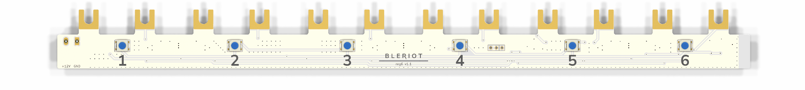
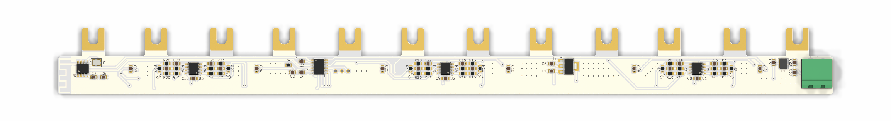

# BleRiot REG6

REG6 is a six-channel solid-state-relay controller built around a
PY32F030 and PAN2110. This repository contains the KiCad hardware and a
standalone TinyGo/BleRiot module under `fw/` that exposes one integer percentage
for each channel.




## Hardware

The firmware targets a PY32F030x8 at 24 MHz. TIM1 and TIM3 generate all six
PWM outputs in hardware at a common 24 kHz frequency. Each analog path uses a
loaded two-stage 1.5 kOhm/100 nF RC ladder, whose poles are approximately
405 Hz and 2.78 kHz, followed by an LM358 with a nominal gain of 1.56. At 50%
duty, the ideal nominal filter model predicts about 12 mV peak-to-peak ripple
at 24 kHz, compared with about 2.56 V peak-to-peak at 1 kHz. The PAN2110 uses the
BleRiot three-wire SPI driver, and six chained WS2812B LEDs report channel and
link state.

| Function | MCU pin | Peripheral | Alternate function |
|---|---|---|---:|
| PWM channel 1 | PA8 | TIM1_CH1 | AF2 |
| PWM channel 2 | PA9 | TIM1_CH2 | AF2 |
| PWM channel 3 | PA10 | TIM1_CH3 | AF2 |
| PWM channel 4 | PB4 | TIM3_CH1 | AF1 |
| PWM channel 5 | PB5 | TIM3_CH2 | AF1 |
| PWM channel 6 | PF3 | TIM3_CH3 | AF13 |
| PAN2110 CSN | PF1 | GPIO | - |
| PAN2110 SCK | PA2 | GPIO, bit-banged SPI | - |
| PAN2110 DATA | PA3 | GPIO, bidirectional SPI | - |
| WS2812B data, D1-D6 | PF4 | GPIO | - |

The development inventory uses raw RF channel 37 with BLE Coded PHY S8. Its
address and XTEA key were generated offline with BleRiot's `node new` command
and are baked into the image by `node build`. This checked-in identity is public
bench provisioning; deployments must use a separately generated private
inventory identity and key.

## Registers

The `ssr` inventory instance publishes exactly these writable Registry
registers:

| Registry name | Wire tag | Registry type | Range |
|---|---:|---|---:|
| `ssr.channel.1` | 1 | int | 0..100 |
| `ssr.channel.2` | 2 | int | 0..100 |
| `ssr.channel.3` | 3 | int | 0..100 |
| `ssr.channel.4` | 4 | int | 0..100 |
| `ssr.channel.5` | 5 | int | 0..100 |
| `ssr.channel.6` | 6 | int | 0..100 |

Values are direct integer percentages on the Registry and `int32` wire protocol.
Firmware clamps assignments to 0..100, and a Registry NULL assignment clears
that channel to zero.
Register tags are permanent wire identities and must not be renumbered or
reused.

## Status And Safety

While BleRiot is online, each LED represents its matching channel: zero is
blue, 100 is red, and intermediate values are a linear blue-to-red blend. The
WS2812 driver's global brightness is 128/255, approximately 50%.

The node starts offline. If no valid packet has arrived, or packets stop for
more than five seconds, firmware clears all six retained levels and forces both
timers to update with 0% duty immediately. D1 then pulses yellow for 200 ms
once per second; D2-D6 remain off. A radio initialization failure follows the
same safe output and heartbeat behavior. Reconnection does not restore old
levels: each active channel requires a fresh SET.

## Build And Run

The module uses released BleRiot and TinyGo driver modules pinned in `fw/go.mod`.
Install TinyGo and the PY32 pyOCD pack, then run:

```sh
go -C fw test ./...
make -C fw build
make -C fw install-pack
make -C fw flash
```

Firmware v0.1.0 was built with Go 1.26.3, TinyGo commit
`f8e1f465ecae33c58772c099f9b7667c00cea9c1`, LLVM 18.1.8, pyOCD 0.44.0, and
the Puya PY32F030 CMSIS pack 1.2.8.

`make -C fw flash` builds the `ssr` inventory instance, programs it through
pyOCD, and opens RTT under reset. Confirm the intended board and probe before
using that target. To inspect generated firmware without flashing:

```sh
go -C fw run ./cmd/dev node build --name ssr
go -C fw run ./cmd/dev node gen --name ssr
```

Run the hub against a Registry service with:

```sh
go -C fw run ./cmd/dev hub --registry http://localhost:8080 --diagnostics rf
```

`make -C fw new` prints another random inventory stub; it does not update the
checked-in development identity automatically.

## Bench Validation

Perform initial validation with low-voltage loads only and no mains connected:

1. Build and flash the firmware, then verify D1 pulses yellow and every PWM pin
   is low before the hub sends a valid packet.
2. Start the hub and write 0, 50, and 100 to each Registry channel in turn.
   Scope PA8, PA9, PA10, PB4, PB5, and PF3; expect a constant low at 0%, a
   24 kHz waveform at 50%, and a constant high at 100% duty.
3. Confirm D1-D6 track their corresponding values from blue through the linear
   blend to red, with the chain limited to approximately 50% brightness.
4. Set all channels nonzero, stop RF traffic for more than five seconds, and
   verify every PWM output goes low and only D1 pulses yellow for 200 ms per
   second.
5. Restore RF traffic without sending SETs and confirm all outputs remain off.
   Send fresh SETs and verify only those channels resume.
6. Repeat power-up with the PAN2110 unavailable or misconfigured and confirm
   all PWM outputs remain low while the offline heartbeat continues.

After logic-level validation, verify the complete channel output stages and
load polarity against the schematic before connecting actual SSR loads.